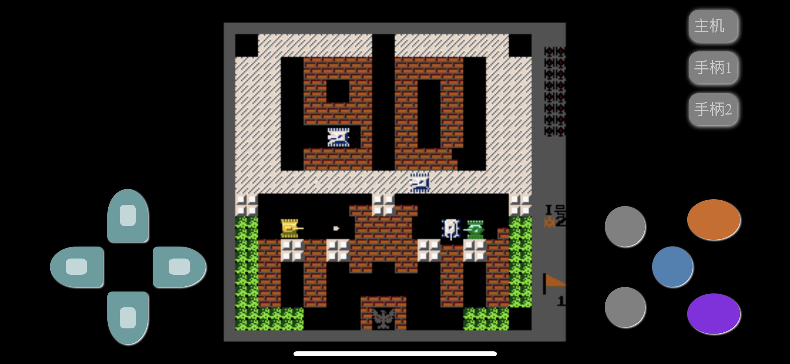

# NesPlayer

## Screenshots 



## Eyes-free controller
Use cellphones as controllers to connect another device (eg: a big screen computer).


## Folder
* /A.应用/.nes/    --nes roms folders
## nginx config
```nginx
    location / {
        root   /usr/share/nginx/html;
        index  index.html index.htm;
        add_header Access-Control-Allow-Origin *;
        autoindex on;
        charset utf-8;
    }

    location /socket.io {
      proxy_set_header X-Forwarded-For $proxy_add_x_forwarded_for;
      proxy_set_header Host $host;

      proxy_pass http://<node-server-ip>:9999;

      proxy_http_version 1.1;
      proxy_set_header Upgrade $http_upgrade;
      proxy_set_header Connection "upgrade";
    }
```
